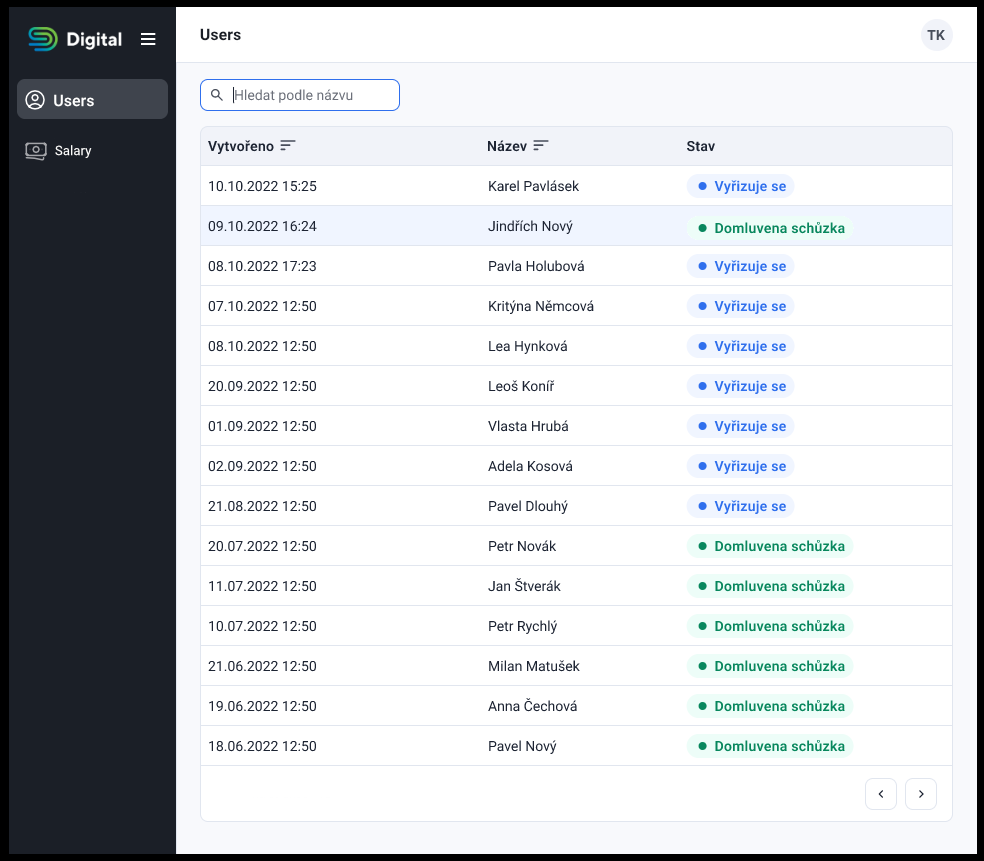
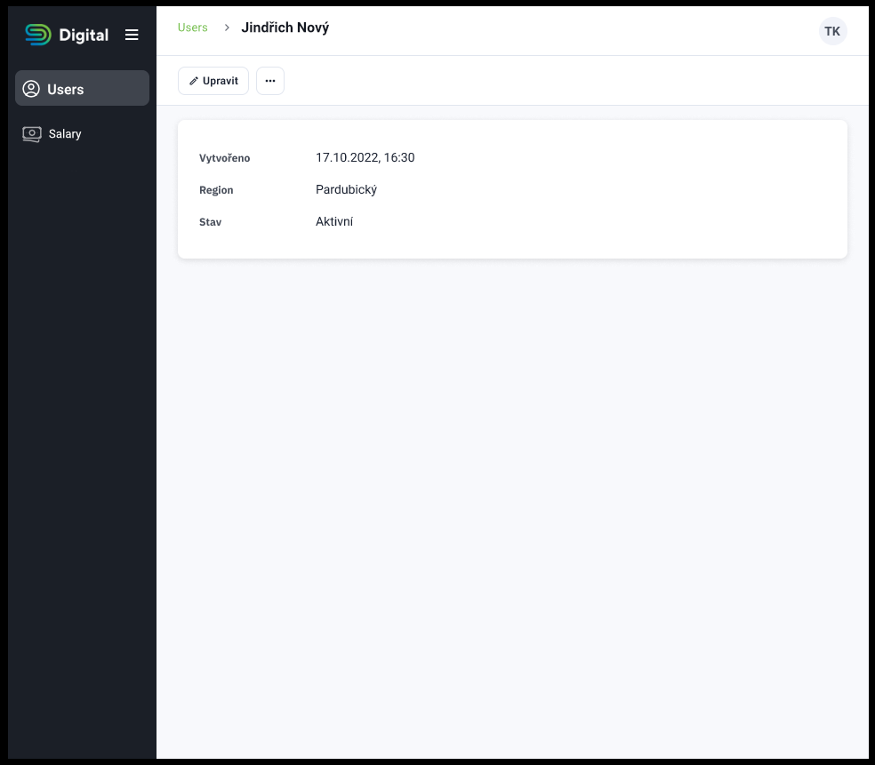
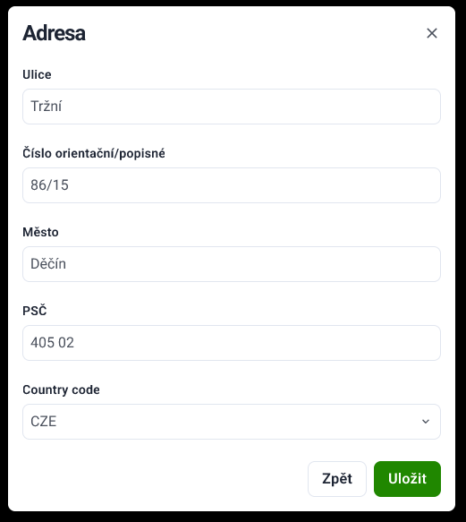

# Zadání FE  úlohy

- Cíle tohoto cvičení jsou:
  - příprava SPA administrace pro modul uživatelů (a zbyde-li čas i modul výplat)
  - nastylování administrace pomocí Tailwindcss podle ilustračního vzoru _níže*_
- K dispozici je interaktvní [Dokumentace API](https://interview-test.digital.cz/api/docs) s public a JWT-protected endpointy na doméne (https://interview-test.digital.cz)
- Povoleno je doinstalovat libovolný node module dle potřeby a použítí čehokoliv, co je existující součástí projektu:
  - [heroicons](https://heroicons.com/) - Doporučeno - (heroicons jsou použity i v ilustračních návrzích)
  - [Nuxt 3](https://nuxt.com/docs/getting-started/introduction) - (Podrobná znalost není v našem případě důležitá, zde nám slouží k rychlému tvoření stránek s implicitním routováním)
  - [Tailwindcss](https://nuxt.com/docs/getting-started/introduction) - Silně doporučeno ke stylování FE komponent
  - [axios](https://www.npmjs.com/package/axios) - Možné použití axios clienta
  - [Projektová  dokumentace](./PROJECT_DOCS.md) - Silně doporučeno její pečlivé pročtení

_*Ilustrační vzor_:

  

## Základní akceptační kritéria
1. Rozložení a UI prvky jsou nastylované přibližně podle vzoru 👆  (sloupce a formulářové prvky odpovídají parametrům dokumentace API)
2. Na root stránce ["/"](http://localhost:3000/) vidím výpis uživatelů
   - (GET na ["https://interview-test.digital.cz/api/users"](http://localhost:3000/auth) endpoint)
   - (funkcionalitu filtrů / řazení / stránkování není potřeba řešit, protože není na zkušebním API implementováno)
3. nad výpisem uživatelů mohu přidávat, upravovat, nebo mazat uživatele
   - skrze vlastní stránku detailu, nebo skrze modálová okna
   - formuláře pro přidání / úpravu mají základní FE validace
4. V postranní navigaci vidím odkaz na výpis [uživatelů](http://localhost:3000/) a odkaz na přihlášení
5. Stránka přihlašení je dostupná na routě ["/login"](http://localhost:3000/login)
   - Nastylovaný přihlašovacího formuláře, odesílá _email_ & _password_ s nově vytvořeným uživatelem na ["https://interview-test.digital.cz/auth"](http://localhost:3000/auth) endpoint

## Bonusová akceptační kritéria
1. JWT token získání pomocí přihlašovacího je uložen do localstorage / cookies
2. Po přihlášení je uživatel přesměrován na modul výplat - salary endpointy jsou vyžadují ověření pomocí JWT tokenu
3. S načteným JWT tokenem se nám v postranním menu ukáže 
4. JWT token je z localstorage/cookie načten i po refreshnutí stránky
5. Základní responzivní stylování
6. Podle času implementovat obdobné funcionality modulu uživatelů do modulu výplat
