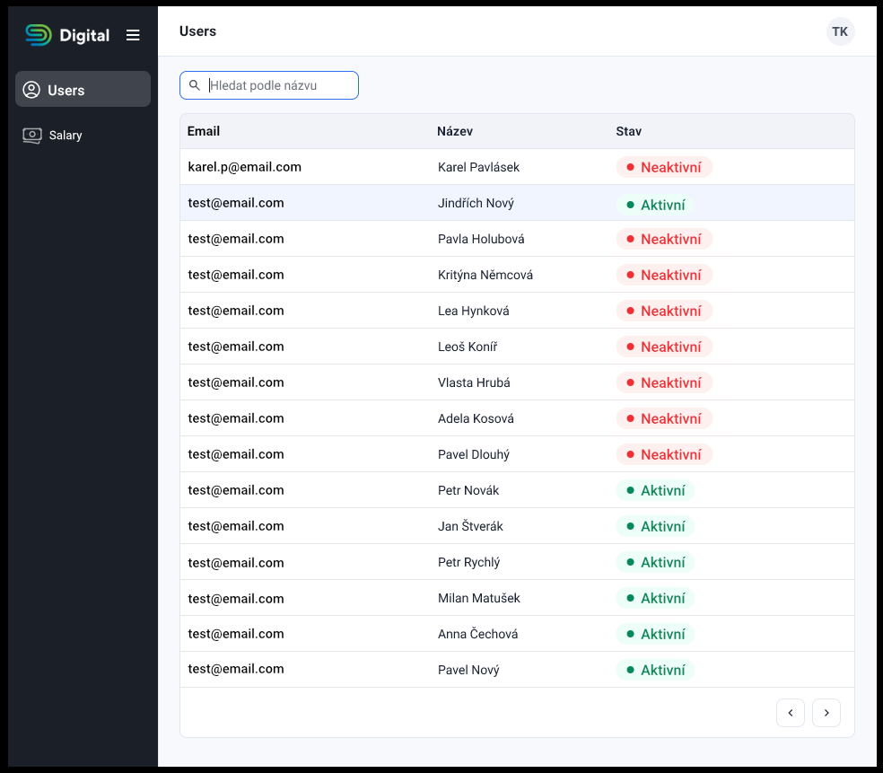

# Zad치n칤 FE  칰lohy

- C칤le tohoto cvi캜en칤 jsou:
  - p콏칤prava SPA administrace pro modul u쬴vatel콢 (a zbyde-li 캜as i modul v칳plat)
  - nastylov치n칤 administrace pomoc칤 Tailwindcss podle ilustra캜n칤ho vzoru _n칤쬰*_
- K dispozici je interaktvn칤 [Dokumentace API](https://interview-test.digital.cz/api/docs) s public a JWT-protected endpointy na dom칠ne (https://interview-test.digital.cz)
- Povoleno je doinstalovat libovoln칳 node module dle pot콏eby a pou쮂셦칤 캜ehokoliv, co je existuj칤c칤 sou캜치st칤 projektu:
  - [heroicons](https://heroicons.com/) - Doporu캜eno - (heroicons jsou pou쬴ty i v ilustra캜n칤ch n치vrz칤ch)
  - [Nuxt 3](https://nuxt.com/docs/getting-started/introduction) - (Podrobn치 znalost nen칤 v na코em p콏칤pad캩 d콢le쬴t치, zde n치m slou쮂 k rychl칠mu tvo콏en칤 str치nek s implicitn칤m routov치n칤m)
  - [Tailwindcss](https://nuxt.com/docs/getting-started/introduction) - Siln캩 doporu캜eno ke stylov치n칤 FE komponent
  - [axios](https://www.npmjs.com/package/axios) - Mo쬹칠 pou쬴t칤 axios clienta
  - [Projektov치  dokumentace](./PROJECT_DOCS.md) - Siln캩 doporu캜eno jej칤 pe캜liv칠 pro캜ten칤

_*Ilustra캜n칤 vzor_:

  

## Z치kladn칤 akcepta캜n칤 krit칠ria
1. Rozlo쬰n칤 a UI prvky jsou nastylovan칠 p콏ibli쬹캩 podle vzoru 游녡  (sloupce a formul치콏ov칠 prvky odpov칤daj칤 parametr콢m dokumentace API)
2. Na root str치nce ["/"](http://localhost:3000/) vid칤m v칳pis u쬴vatel콢
   - (GET na ["https://interview-test.digital.cz/api/users"](http://localhost:3000/auth) endpoint)
   - (funkcionalitu filtr콢 / 콏azen칤 / str치nkov치n칤 nen칤 pot콏eba 콏e코it, proto쬰 nen칤 na zku코ebn칤m API implementov치no)
3. nad v칳pisem u쬴vatel콢 mohu p콏id치vat, upravovat, nebo mazat u쬴vatele
   - skrze vlastn칤 str치nku detailu, nebo skrze mod치lov치 okna
   - formul치콏e pro p콏id치n칤 / 칰pravu maj칤 z치kladn칤 FE validace
4. V postrann칤 navigaci vid칤m odkaz na v칳pis [u쬴vatel콢](http://localhost:3000/) a odkaz na p콏ihl치코en칤
5. Str치nka p콏ihla코en칤 je dostupn치 na rout캩 ["/login"](http://localhost:3000/login)
   - Nastylovan칳 p콏ihla코ovac칤ho formul치콏e, odes칤l치 _email_ & _password_ s nov캩 vytvo콏en칳m u쬴vatelem na ["https://interview-test.digital.cz/auth"](http://localhost:3000/auth) endpoint

## Bonusov치 akcepta캜n칤 krit칠ria
1. JWT token z칤sk치n칤 pomoc칤 p콏ihla코ovac칤ho je ulo쬰n do localstorage / cookies
2. Po p콏ihl치코en칤 je u쬴vatel p콏esm캩rov치n na modul v칳plat - salary endpointy jsou vy쬬duj칤 ov캩콏en칤 pomoc칤 JWT tokenu
3. S na캜ten칳m JWT tokenem se n치m v postrann칤m menu uk치쬰 
4. JWT token je z localstorage/cookie na캜ten i po refreshnut칤 str치nky
5. Z치kladn칤 responzivn칤 stylov치n칤
6. Podle 캜asu implementovat obdobn칠 funcionality modulu u쬴vatel콢 do modulu v칳plat
